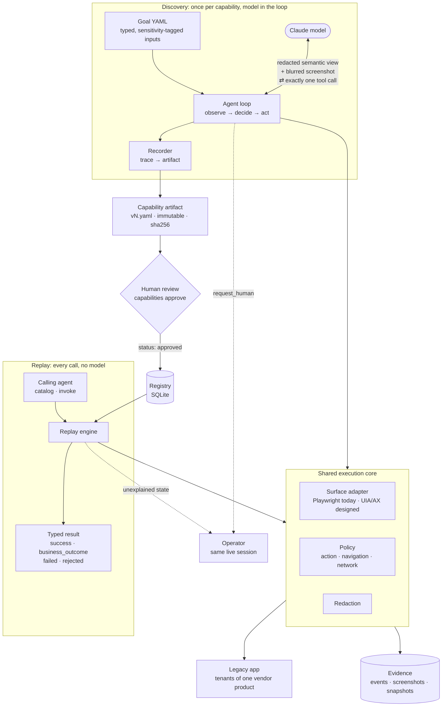
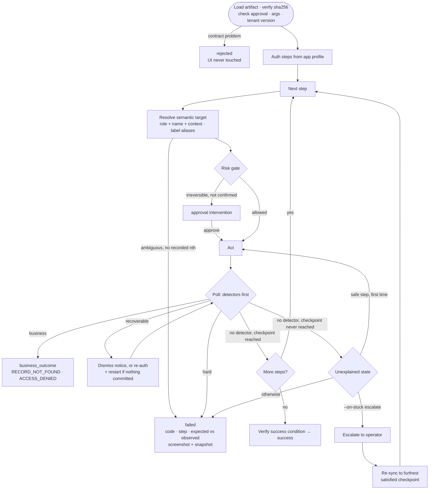
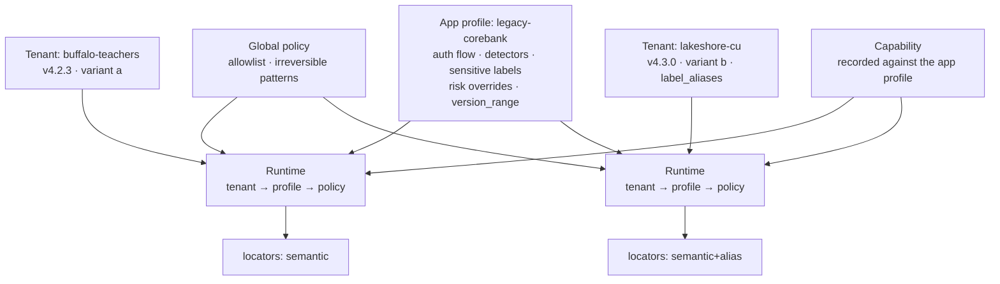
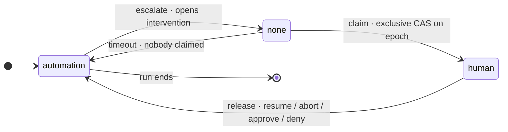
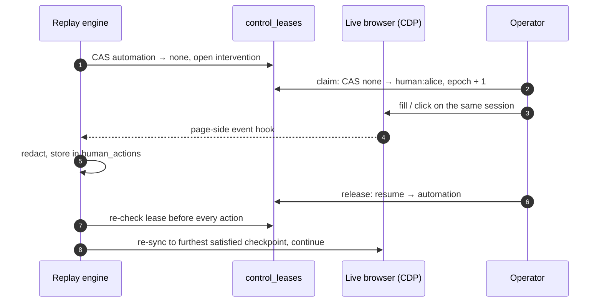
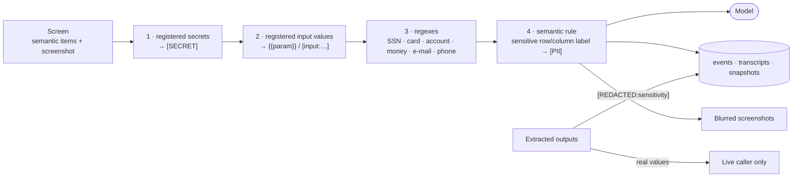

# REPORT

## Architecture

There are two paths that share one execution core. **Discovery** is an observe → decide → act
loop. The model sees a *semantic operator view* of the screen: every frame, every control as
role + visible name, and every text cell with its table row label and column header. It can
optionally see a screenshot with sensitive regions blurred. It answers with exactly one tool call
per turn (click/fill/select by ephemeral ref, `extract`, `done`, `request_human`, `give_up`). The
system performs the action, enforces policy, and records what *actually* happened. The
**Recorder** then turns that trace into an artifact deterministically:

- concrete input values are canonicalised to `{{param}}` tokens;
- each target gets the minimal semantic context that makes it unique on the screen it was used on;
- each step gets a checkpoint, derived from what changed on screen after the action (frame URL
  path plus a newly appeared heading), never from the model's claims.

**Replay** loads an approved artifact and runs, for each step, "classify state → resolve target →
gate risk → act → wait for checkpoint". It never consults a model.

Everything above the surface layer speaks only in `UIItem`s and semantic `Target`s. The
Playwright adapter is one implementation. A desktop adapter would build the same items from the
UIA/AX accessibility tree. The target is a deliberately hostile mock: framesets, table layout, no
ids, opaque field names, random URL tokens, CGI routes, and injectable runtime faults.

State lives in SQLite: registry, runs, events, interventions, leases and human actions. Artifacts
are immutable YAML in git, and evidence is in per-run directories.

## Artifact schema

`cuauto.capability/v1` (pydantic, `extra=forbid`, see `schema/artifact.py`) contains:

- **Identity and compatibility:** `id = <app_id>.<name>`, `version`, and `app.compatible_versions`.
- **Interface:** typed `inputs` (type, pattern/enum, sensitivity) and typed `outputs` (money,
  decimal, …, each with a `source` target and a sensitivity). Declared business `outcomes` are
  the stable codes a caller must handle.
- **Behaviour:** `steps` (intent, action, target, value template, risk class, expect checkpoint,
  origin model|human|profile), a `success` condition, `side_effects`, and `provenance` (source
  run, model, redacted goal, number of human steps).

Validators enforce three things: step templates may only reference declared inputs,
`side_effects` cannot understate the riskiest step, and step ids are unique.

**Targets are semantic.** A target is role + accessible name + context (`frame` hint,
`row_label`, `column_header`, `field_label`). The member's "View" link is pinned to
`row_label: {{member_id}}`, so it finds the right row for any input. A balance is located by
`(row: S00, col: Current Balance)` and never by its value. This survives re-layout, DOM churn,
new columns and frame reshuffles.

**Fallbacks are a last resort.** `nth` is recorded only when a name is genuinely ambiguous. A
recorded XPath is kept as a fallback, and using it is reported as *drift* in the run result.
Ambiguity without a recorded `nth` is a failure, never a guess.

**Content and status are separate.** Artifact content is immutable and hashed; the registry
holds draft / approved / deprecated. Approving therefore never changes what was reviewed, and a
tampered file fails hash verification on load. Every capability also exports a JSON-schema tool
definition, used by `catalog` and `invoke`.

**Committed versions.** `capabilities/legacy-corebank/member_savings_balance/` holds v1–v4, each
from a real discovery run with `claude-sonnet-5-5`. **v4 is the approved version.** The evidence
was produced from it, and every replay in `evidence/runs/` reports `capability_version: 4`. v1 is
still a draft, and v2 and v3 are deprecated. A replay without `--version` resolves to the highest
approved version. The registry status lives in the local SQLite database, not in git.

## Determinism & error handling

Replay waits *for states*, never for time. Each poll matches app-profile **detectors** before
checking the checkpoint. Detectors classify every recognisable runtime state:

- **business** (`RECORD_NOT_FOUND`, `ACCESS_DENIED`, `INPUT_REJECTED_BY_APP`): returned as
  `status: business_outcome`. These are legitimate answers, not errors.
- **recoverable:** the system-notice interstitial is dismissed with a bounded number of
  attempts, then waits until it has cleared. An expired session triggers re-auth and a restart
  from the entry point, but only if no irreversible step has been committed.
- **hard** (application ABEND, rejected credentials): returned as `status: failed`.

Contract problems (bad arguments, unapproved version, wrong app, tenant version out of range)
return `status: rejected` *before the UI is touched*.

The per-step loop, with every exit it can take:

**Unexplained states** are those with no matching detector where the checkpoint is never
reached. A safe step is retried once. After that the run either escalates (with
`--on-stuck escalate`) or fails.

**Every failure is structured:** code, step id and intent, what was expected (the
target/checkpoint), what was observed (a redacted headline/controls summary), whether it is
retryable, and evidence paths (a blurred screenshot and a redacted semantic snapshot). Any
policy-blocked network requests are listed too. Engine exceptions are also caught and reported as
`ENGINE_ERROR` with the same evidence.

Results also list each recovery performed and the locator strategy per step, so drift shows up
before it breaks anything.

## Heterogeneity & multi-tenant

There are three configuration layers:

- **Global policy:** the allowlist and irreversible-action patterns.
- **App profile, per vendor product:** auth flow, detectors, sensitive labels, risk overrides,
  `version_range`.
- **Tenant, per institution:** base URL, credential env vars, product version, label aliases and
  policy deltas.

Capabilities are recorded against the *app profile*, not the tenant. A capability recorded on
Buffalo Teachers (v4.2.3) replays unchanged on Lakeshore CU. Lakeshore runs v4.3.0 with different
labels: "Member Lookup", "Member #", "Find", "New Share". The tenant's `label_aliases` absorb the
difference, and the run reports `semantic+alias` per step. A tenant outside the compatible range
is rejected with `INCOMPATIBLE_VERSION` rather than attempted.

For desktop apps and Citrix-style screens, the same `Surface` protocol applies. A UIA/AX adapter
yields the same role/name/context items. A pixels-only surface would use OCR or VLM grounding,
with `coordinates` fallbacks flagged as drift. Its checkpoints would become text-present checks
on OCR output. I designed and documented this but did not implement it.

## Escalation & handoff

**Control lease.** Control of the live session is one row per run in `control_leases`:
`holder_kind` (automation | none | human), `holder`, and a fencing `epoch`. Every transfer is a
compare-and-set on the epoch. The lifecycle is:

1. *Escalate:* `automation → none`, and an intervention is opened. It carries the reason, step,
   expected-vs-observed, a screenshot and a snapshot.
2. *Claim:* `none → human:<op>`. This is exclusive, so a second operator loses the race.
3. *Release* with a resolution (`resume | abort | approve | deny`): `→ automation`.

The automation re-checks the lease before *every* action, so a stale holder can never act. On
timeout it takes the session back only if nobody claimed it; it never snatches control from a
human.

The handoff for one intervention, end to end:

**Same live session.** The browser is launched with a CDP endpoint, which is recorded on the
intervention. The operator attaches to that same browser (same cookies and frame state) through
`cuauto operator act` or the console's live view and act form. In production this would be a
co-browse or remote-desktop viewer; the control model stays the same.

**Recording human actions.** While a human holds the lease, the page-side event hook delivers
their clicks, fills and selects to the running automation. These are redacted (password fields
and sensitive labels become `[REDACTED]`) and stored in `human_actions`.

- In discovery, human clicks and selects become artifact steps with `origin: human`.
- In replay, if a human performed an irreversible action, the run is marked committed, which
  blocks unsafe restarts.

**After hand-back.** The engine does not assume the human finished the step. It **re-syncs** to
the furthest checkpoint (or the success condition) that the current screen satisfies, and fails
with `RESYNC_FAILED` if none match.

## Safety

Policy is enforced at three layers:

- **Actions:** the action type must be allowed.
- **Navigations:** the engine checks the URL before it initiates any navigation.
- **Network:** every browser request passes through a default-deny route guard on
  origin + path globs. Vendor admin and logout paths are denied, so even a stray click cannot
  reach them.

**Risky actions.** Risk is classified per action from the control's label, plus app-profile
overrides ("Open Sub-Account" is safe, "Confirm and Open" and "Authorize" are irreversible). The
runtime classification can only *raise* the recorded risk.

- Discovery never executes irreversible actions; the model is told to stop or request a human.
- Replay executes them only on an *approved* capability with `--confirm-irreversible`, or after
  a human `approval` intervention.
- Draft capabilities need `--allow-draft`.

**Credentials** are injected by the app profile's auth steps. The model never sees them, and
they are redacted as `[SECRET]` everywhere.

**Redaction runs in layers**, before anything is logged, persisted or sent to the model:

1. registered secrets;
2. registered input values (digit-boundary aware, so ids inside URL-encoded strings are caught);
3. regexes for SSN, card, account, money, e-mail and phone;
4. a semantic rule: a cell whose row or column label is sensitive becomes `[PII]`. This is what
   catches names, which no regex can.

Screenshots are blurred by the same rules. Persisted outputs are redacted by their declared
sensitivity; only the caller receives real values. Raw DOM is never persisted.

## Cuts

These are deliberate omissions, roughly in the order I'd add them:

- A desktop / pixel surface adapter (designed above, not built).
- A real co-browse viewer instead of CDP attach plus a minimal console.
- Detectors and checkpoints that use OCR for non-text screens.
- Credential vaulting (env vars stand in).
- Postgres and multi-worker scheduling: the repo layer is portable SQL, and leases already fence.
- Automatic re-recording when drift is detected.
- Diffing artifacts between versions.
- Richer output types (tables / lists).
- Model-assisted *repair proposals* for failed replays (drafts only, still human-approved).

Discovery runs one model at a time with no planner or critic. Any check that compares against the
screen (`done`, extraction) is verified by the system rather than trusted.
